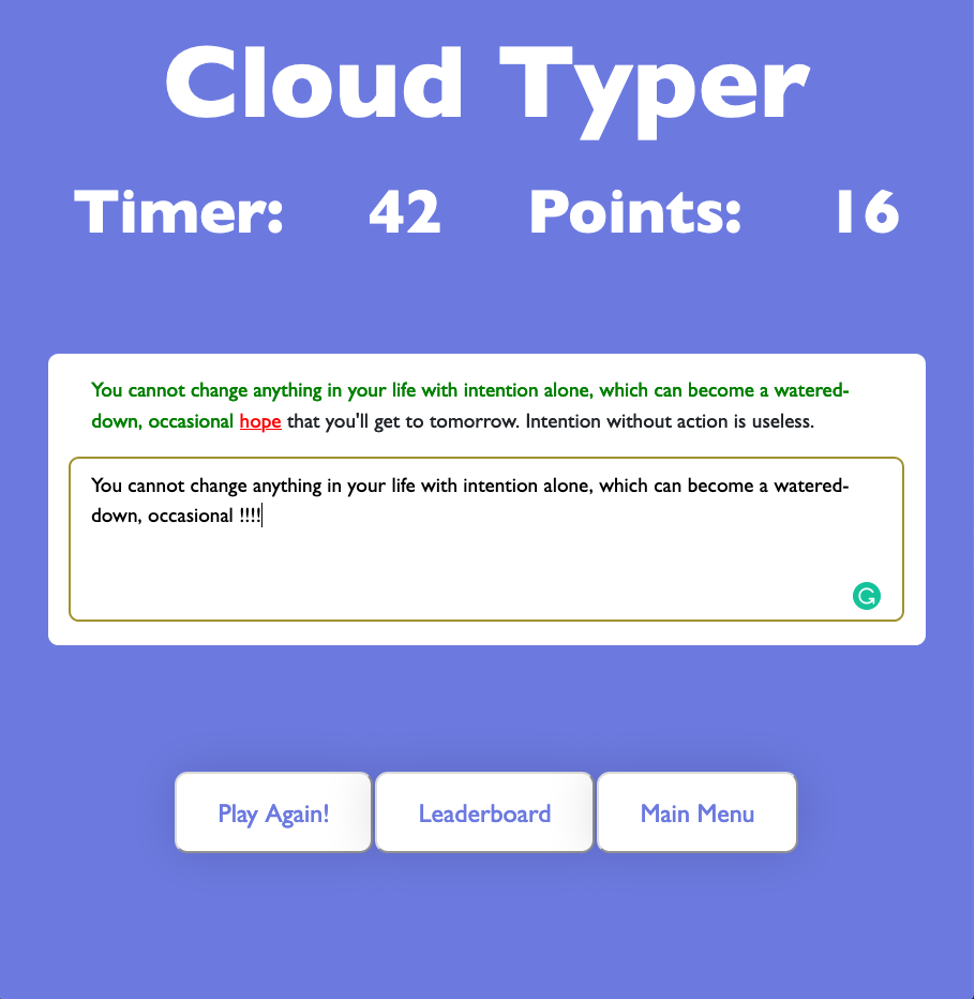

# APP IS CURRENTLY DOWN!
## 							Cloud Typer

### <u>Description</u>

Cloud Typer is a simple typing game that allows users to compete with friends or anyone in the world. Users will have 60 seconds to type and the final score will be all the words the user successfully entered. This score will automatically be passed to our server and get recorded in our database. Besides playing the game, users can view their personal best or visit the leaderboard to see the top 10 faster users. Our application is built with the help of AWS Elastic Beanstalk, Cognito, CodeCommit, CloudFront, CloudWatch, DynamoDB, SNS, S3, Quote API, and our player server. By utilizing these web services, we were able to implement login/registration, authentication, and notification.

### <u>URLs</u>

Web application - http://cloudtyper.s3-website-us-west-2.amazonaws.com/ 
Our server - http://cloudtype.us-west-2.elasticbeanstalk.com/

- Leaderboard- http://cloudtype.us-west-2.elasticbeanstalk.com/leaderboard/top10
- Profile - http://cloudtype.us-west-2.elasticbeanstalk.com/profile/?email=

### <u>How to Play!</u>

1. Visit http://cloudtyper.s3-website-us-west-2.amazonaws.com/
2. Register with an email and password
3. A verification email will be sent, click the link to be verified
4. An leaderboard subscription will also be sent. Accept to get notified when a new player gets rank 1.
5. Login with registered email and password
6. At the main menu page, click on the “play game” button to start playing!

### <u>**Services Used (10)**</u>

